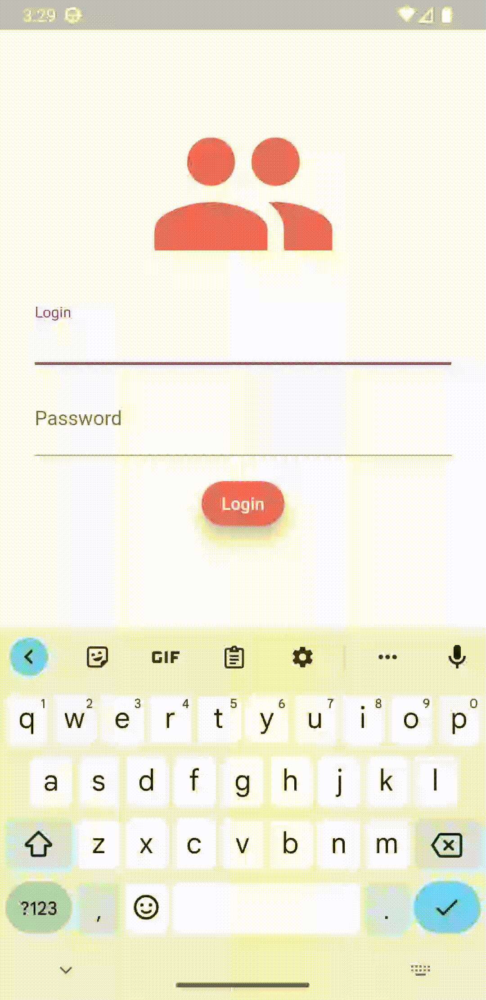
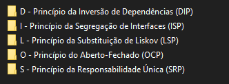

# Flutter Studies

#
# Level 01 Studies                                                            
                                                                            
    - Main Components  
    - Customizable Widgets
    - Working with Routes
    - MVC architecture 
    - Consuming the API https://jsonplaceholder.typicode.com/posts\      
### Access the repository by [clicking here][dill]

#
# Flutter Project Level 01

    - Customizable Widgets
    - Working with Routes
    - Repositories
    - Services
    - Splash Page
    - SharedPreferences
    - ValueListenableBuilder
    - ValueNotifier
    - Authentication
    - Consuming the API https://jsonplaceholder.typicode.com/posts\     
### Access the repository by [clicking here][dill2]

#
# Flutter Level 02 - SOLID
### S - Single responsibility principle -(SRP):
     1. A cohesive class is one that has a single responsibility
     2. A single responsibility per class.
     3. A class should have only one reason to change
     4. Your responsibility is always on one and only one actor
     5. It does not take care of more than one concept in the system.

### O - Principle of open\closed
     open for extension
     Closed for modifications

### L - Liskov Substitution Principle (LSP)
     - Mathematical principle
     - Subtypes must be replaceable by their base types

Able to change without breaking the system

### I - Segregation of Interfaces
     Many specific Interfaces are better than a general one.
     Break an interface that contains multiple operations into multiple separate contracts

### D - Dependency Inversion Principle (DIP)
     Rely more on abstractions rather than concrete classes
### Access the repository by [clicking here][dill3]

#
# Flutter Clean Architecture

### Currently studying Clean Architecture and building a project to use the principles of this architecture

### The most volatile code is at the bottom (Blue Layer)
### The code that changes the least is at the top (Entities)

### Separation of applications based on business rules

- Entities and Use cases - Domain layer
- All data management. Access, representation, change - Data layer (data)
- Screens, converts user inputs to the expected type. User Input and Output - Presentation Layer

### The upper layer knows nothing of the lower layers, but the one below knows everything that is above.

### Communication between layers - SOLID (Contracts)
### Access the repository by [clicking here][dill4]

[dill]: <https://github.com/beatrizgomess/flutter-studies/tree/main/Nv1/study_flutter_nv1/flutter_nv1_basic>

[dill2]: <https://github.com/beatrizgomess/flutter-studies/tree/main/Nv1/project_flutter_nv1>

[dill3]: <https://github.com/beatrizgomess/flutter-studies/tree/main/Nv2/flutter_SOLID>

[dill4]: <https://github.com/beatrizgomess/flutter-studies/tree/main/arquitetura_flutter/clean_architecture>

